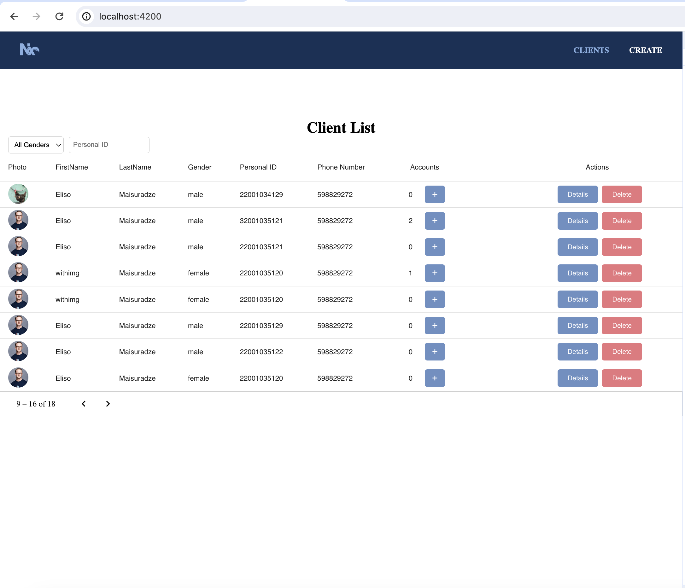
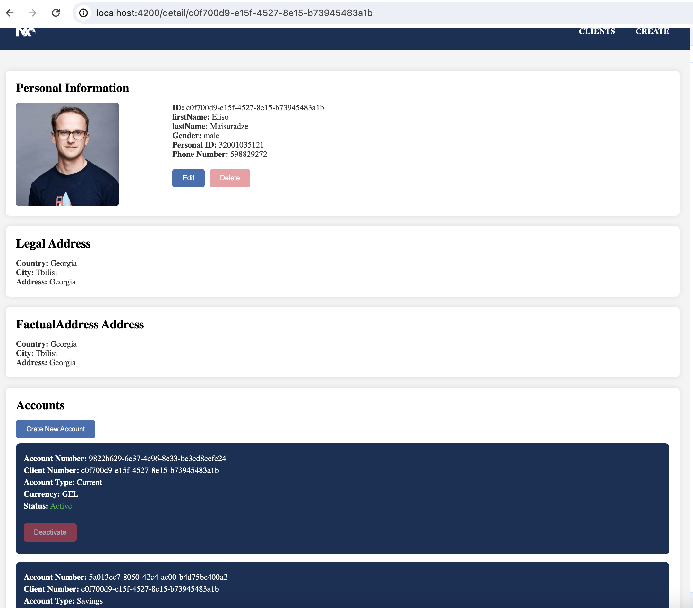
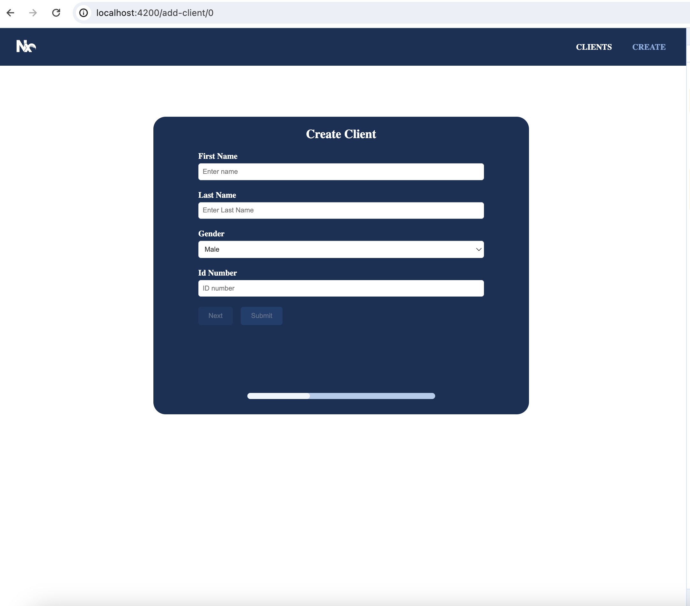

# AngularMonorepo

<a alt="Nx logo" href="https://nx.dev" target="_blank" rel="noreferrer"></a>

✨ **This workspace has been generated by [Nx, Smart Monorepos · Fast CI.](https://nx.dev)** ✨


## Start the application

For Json Server run `npm run json-server`


To Serve App `npm start` to start the development server. Happy coding!


## Description 

This project is an application created using Nx. It consists of two apps: one for the front-end and the other for serving images through an Express app. In the Libraries section, there is a shared library generated using nx,  containing reusable elements such as pipes, directives, validators, styles, and components.


    

The front-end is developed using Angular 17 and incorporates various technologies including ngrx store, reactive forms, Angular animations, reusable components, standalone components, and Angular Material.


The back-end is served using json-server, while the Express app utilizes the multer package to store and serve images.


Dependency management is organized such that only apps can import modules from libraries, not vice versa.

### Clients Page
The Clients Page features an Angular Material table with pagination functionality. Users can utilize simple and detailed filters, change genders, and search by personal information or a combination of both.


In case if no user is found after a search, an information modal is displayed with a shake animation using Angular animations. Additionally, when a user is deleted from the table, an Angular animation is triggered and the deleted item slides out.


Admin actions include viewing details or removing users, with the edit button accessible within the detail page.

   

### Detail Page

The Detail Page presents comprehensive information about a user, along with options to edit or delete their details. Below, a user Account list is displayed, enabling the creation of new accounts or modification of existing ones.


This page utilizes a resolver guard to load user information before the page loads. 

   


### Form Page

The form is created using reactive forms and includes custom validations, you can find in in `form.validators.ts`. An async validator ensures that the Personal ID is unique.

Additionally, it features canActivate and canDeactivate guards, triggering a confirmatiomodal if a user attempts to leave the page with unsaved changes.


Angular slide animations are implemented during page transitions, providing smooth effects. The submit button is only activated when all required fields are valid.


After submission, a generic modal notifies the user of the success and displays the added user's ID, which can be clicked to navigate to the detail page.

    
  


## Build for production

Run `npx nx build client-directory` to build the application. The build artifacts are stored in the output directory (e.g. `dist/` or `build/`), ready to be deployed.

## Running tasks

To execute tasks with Nx use the following syntax:

```
npx nx <target> <project> <...options>
```

You can also run multiple targets:

```
npx nx run-many -t <target1> <target2>
```

..or add `-p` to filter specific projects

```
npx nx run-many -t <target1> <target2> -p <proj1> <proj2>
```

Targets can be defined in the `package.json` or `projects.json`. Learn more [in the docs](https://nx.dev/features/run-tasks).

## Set up CI!

Nx comes with local caching already built-in (check your `nx.json`). On CI you might want to go a step further.

- [Set up remote caching](https://nx.dev/features/share-your-cache)
- [Set up task distribution across multiple machines](https://nx.dev/nx-cloud/features/distribute-task-execution)
- [Learn more how to setup CI](https://nx.dev/recipes/ci)

## Explore the project graph

Run `npx nx graph` to show the graph of the workspace.
It will show tasks that you can run with Nx.

- [Learn more about Exploring the Project Graph](https://nx.dev/core-features/explore-graph)

## Connect with us!

- [Join the community](https://nx.dev/community)
- [Subscribe to the Nx Youtube Channel](https://www.youtube.com/@nxdevtools)
- [Follow us on Twitter](https://twitter.com/nxdevtools)
